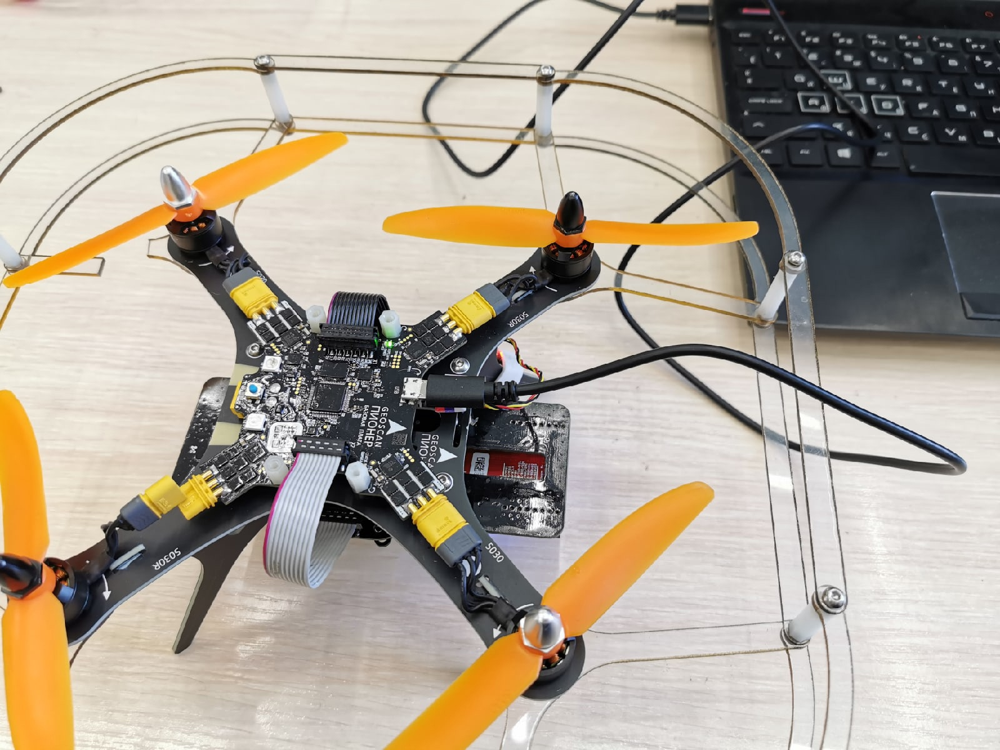
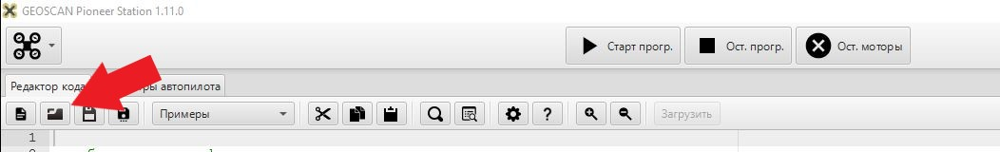
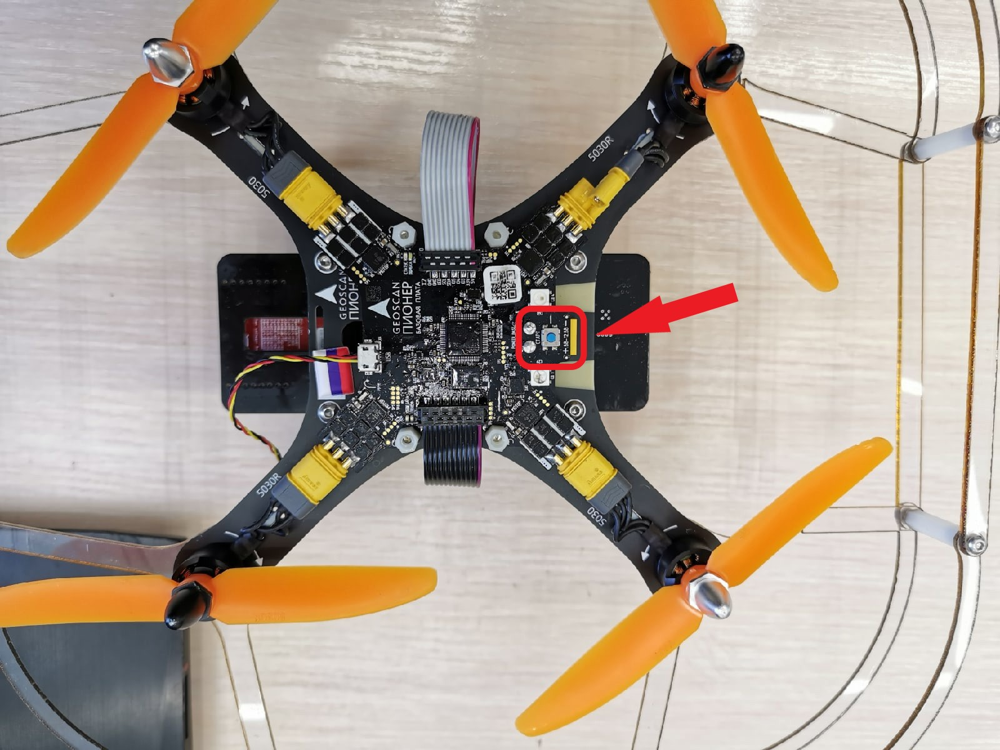

# необходимое ПО и инструкция для конкурса АгроНТИ 2021 по направлению АгроКоптеры

## Описание
Квадрокоптер пионер имеет на своем борту: плату управления, [плату подключения дополнительных модулей](https://pioneer-doc.readthedocs.io/ru/master/module/board.html),
[модуль захвата груза](https://pioneer-doc.readthedocs.io/ru/master/module/cargo.html) и [программируемую камеру OpenMV](https://pioneer-doc.readthedocs.io/ru/master/module/openMV.html).

В собранном виде все это выглядит вот так:

Отдельно от коптера:

## Подготовка

1) Сперва необходимо провести настройку [пульта управления](./pult_setting)

2) Необходимо установить следующую программу:
* [Pioneer Station](https://pioneer-doc.readthedocs.io/ru/master/programming/pioneer_station/pioneer_station_main.html)

3) Необходимо скачать файлы:
* **aruco_uart_led.lua**
* **main.py**

## Установка
### OpenMV
Подключите программируемую камеру OpenMV к компьютеру с помощью USB кабеля. 

На компьютере камера должна появится как внешний накопитель. Откройте ее в проводнике.
Необходимо скопировать файл main.py в кореневую папку устройства

### Пионер
* Подключите коптер к компьютеру с помощью USB кабеляи. 
  
  
* Запустите программу Pioneer Station.
* Необходимо нажать кнопку открытия файла и выбрать скаченный скрипт aruco_uart_led.lua:

  
* В правом нижнем углу приложения Pioneer Station выберите: 
  

* Загрузите файл на коптер:

* Запустите LUA скрипт на коптере зажав кнопку на базовой плате 

### Описание LUA скрипта
тумблер SWA - вкл/выкл электромагнита  
тумблер SWD - световая индикация считанных цифровых меток, работает когда коптер на земле. При отключении АКБ данные сбрасываются  
во время полета при считывании цифровой метки светодиоды на коптере мигают соответствующим цветом  
  0 - белый  
  1 - красный  
  2 - зеленый  
  3 - синий  

### Цифровые метки
* Скачайте файлы цифровых меток из папки [AGRO_NTI/markers/](./markers)
* Распечатайте метки на притере
* Метку 0 из файла id_0_30x30.pdf обрезать и наклеить на отвал робота.

* Метки 1-3 обрезать по квадрату 200х200мм и разместить на полигоне согласно схеме.

