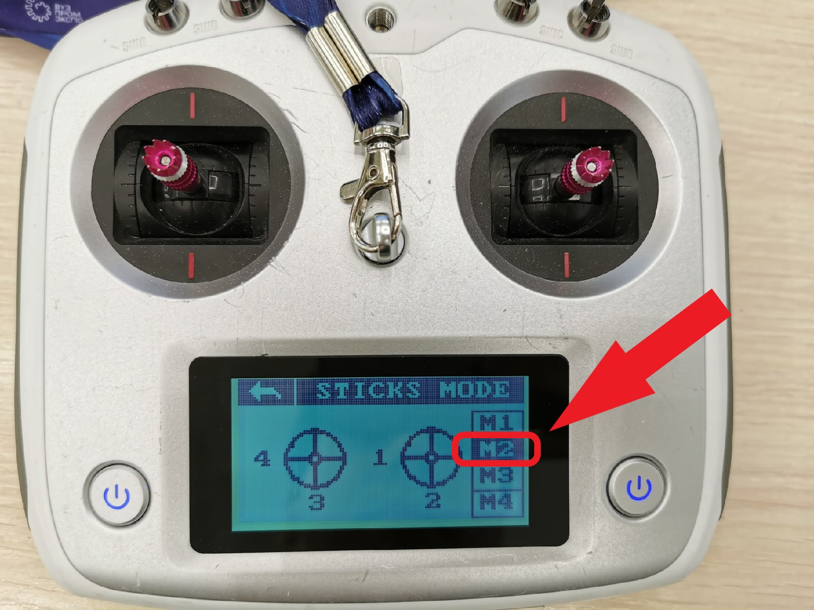

# Описание настройки пульта дистанционного управления

Перед полетами или тренировками в симуляторе сперва необходимо произвести настройку пульта дистанционного управления.

Инструкция по [настройке](https://pioneer-doc.readthedocs.io/ru/master/instructions/pioneer-standart/settings/rc_setting.html)

Инстуркция по настройке с картинками:
1) После включения пультра перейдите в настройки:

   
2) В разделе "FUNCTION" выберете пункт "Reverse"
   
   
3) Необходимо изменить режим работы Ch2 и Ch4 с Nor на Rev (нажать на надпись Nor)
   
   
4) В разделе "FUNCTION" выберете пункт "Aux. channels"
5) В открывшемя окне происходит настройка работы каналов. 
   
   При выбранном 5ом канале необходимо задать тип канала нажав на значок:
   
   
6) В открывшемся окне выбрать режим SWx
   
   
7) Далее нажать на SwA и выбрать SwC
   
   Итговый вид настройки 5го канала:
   
   
8) Повторить пункты 5-7 для каналов 6,7,8. Отличие лишь в том, что в пункте 7 нужно выбрать для
каждого канала свое значение:
   * Channel 5 -> SwC
   * Channel 6 -> SwD
   * Channel 7 -> SwB
   * Channel 8 -> SwA
   
9) Далее необходимо перейти в меню во вкладку "SYS" и выбрать пункт "OUTPUT MODE"
   
   
10) В разделе "OUTPUT" выбрать "PPM"
   

11) Далее выбрать пункт "STICKS MODE" и выбрать "M2"

    
Настройка пульта на этом заканчивается

Инстуркция по подключению пульта к [коптеру](https://pioneer-doc.readthedocs.io/ru/master/instructions/pioneer-standart/settings/rc_connection.html)

   