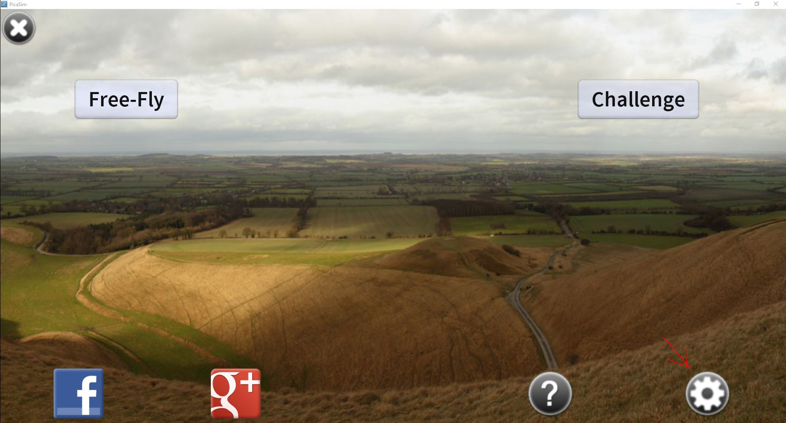
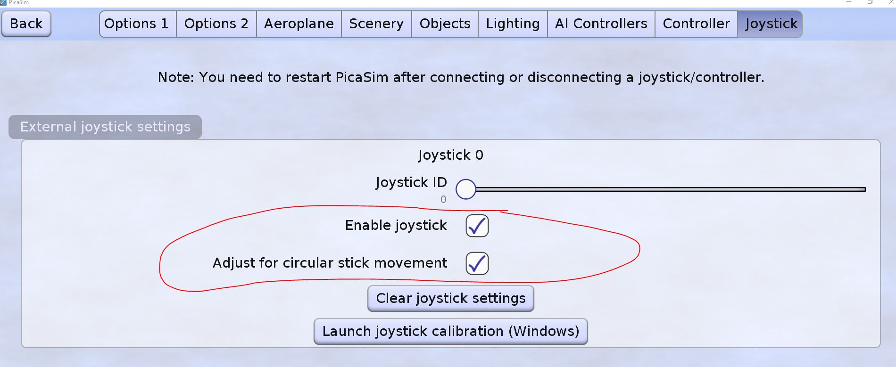
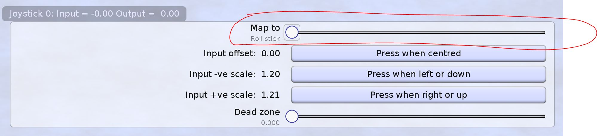
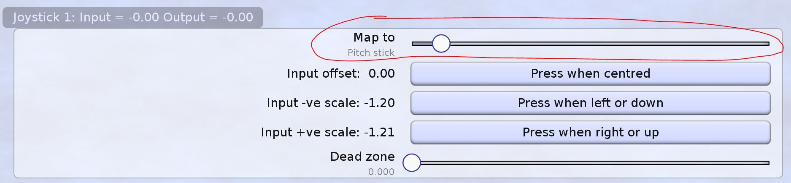
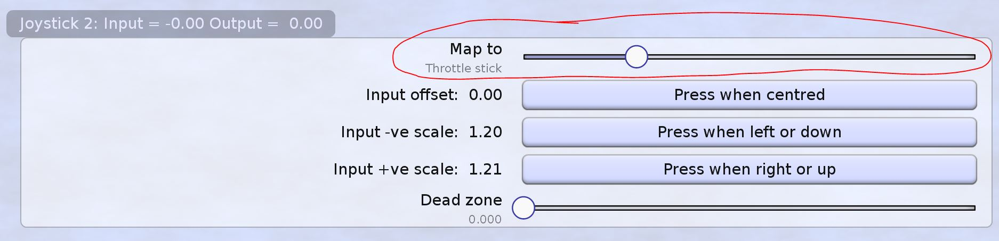
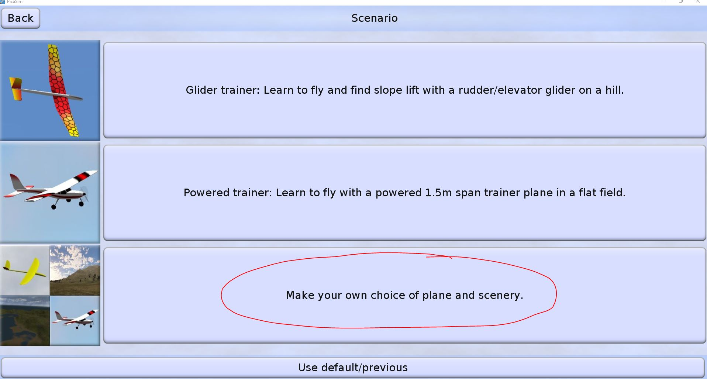
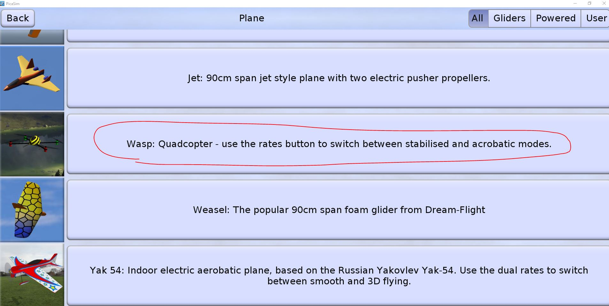
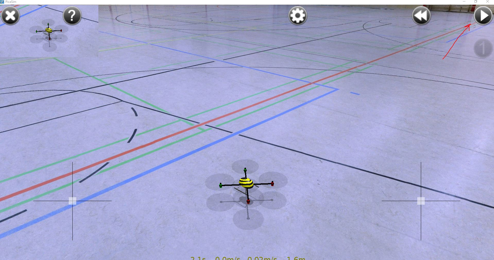

# Авиасимулятор
## Подготовка
1) Установите приложение [PicaSim](http://www.rowlhouse.co.uk/PicaSim/download.html)
2) Подключите к компьютеру по micro usb пультр радиоуправления
3) Запустите приложение PicaSim и перейдите в настройки:

## Инициализация стиков
1) Перейдите во вкладку Joystick
2) Необходимо установить галочки в пунктах "Enable joystick" and "Adust for circular stick movement":

   
3) Необходимо пролистать вниз до раздела "joystick 0: "
Данный раздел отвечает за ПРАВЫЙ стик (движение вверх вниз) на пульте.
* переведите ползунок "Map to" в режим "Roll stik":

* параметр "input offset: " устанавливается при стике в нейтральном положении. 
  Отпустите правый стик и нажмите "Press when centred"
  
* параметр "input -ve scale: " устанавливается при стике в левом нижнем положении. 
  Переместите правый стик внужное положение и нажмите "Press when left or down"
  
* параметр "input +ve scale: " устанавливается при стике в правом верхнем положении.

4) Необходимо пролистать вниз до раздела "joystick 1: "
Данный раздел отвечает за ПРАВЫЙ стик (движение влево вправо) на пульте.
* переведите ползунок "Map to" в режим "Pitch stik":

* установите оставшиеся параметры таким же образом, как в пункте 6.

5) Необходимо пролистать вниз до раздела "joystick 2: "
Данный раздел отвечает за ЛЕВЫЙ стик (движение вверх вниз) на пульте.
* переведите ползунок "Map to" в режим "Throttle stik":

* установите оставшиеся параметры таким же образом, как в пункте 6.

6) Необходимо пролистать вниз до раздела "joystick 5: "
Данный раздел отвечает за ЛЕВЫЙ стик (движение вправо влево) на пульте.
* переведите ползунок "Map to" в режим "Yaw stik":

* установите оставшиеся параметры таким же образом, как в пункте 6.

7) Инициализация осей завершена. Выйдете в главное меню нажав кнопку "Back"

## Первый полет
1) Нажмите "Free-Fly" в главном меню
2) Выберите третью вкладку:

   
3) Листайте в самый низ и выбирайте вкладку с квадракоптером:

   
4) Выберите понравившуюся сцену (например спортивный зал)
5) Нажмите кнопку пуск в верхнем правом углу

   